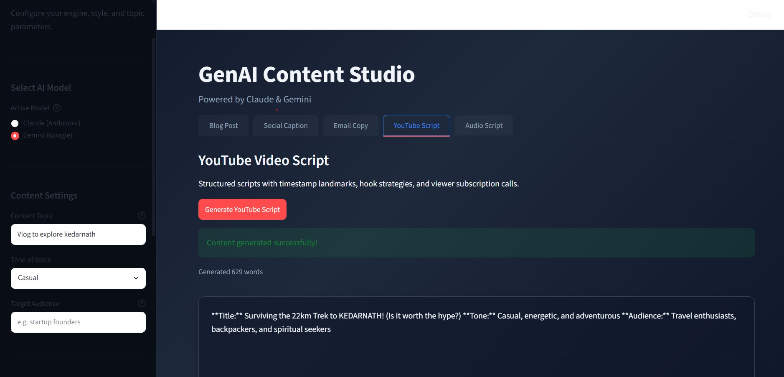

# 🎨 GenAI Content Studio

Multi-format AI content generation powered by Claude & Gemini. 

This interactive Streamlit application lets creators, marketers, and developers generate high-quality copy across five separate formats (Blog Posts, Social Captions, Marketing Emails, YouTube Scripts, and Audio Script voiceovers) using leading GenAI models: Anthropic's **Claude 3.5 Sonnet** and Google's **Gemini 3.5 Flash**.



## Features
- **Dual Model Selector**: Switch seamlessly between **Claude (Anthropic)** and **Gemini (Google)**.
- **Multimodal Support**: Upload context images (PNG, JPG, WEBP) to perform visual analysis and tailor copy referencing visual cues.
- **5 High-Converting Formats**:
  - 📝 **Blog Posts**: Markdown-structured articles with headings, introduction, body, and CTA.
  - 📱 **Social Captions**: Platform-appropriate content for Instagram, LinkedIn, Twitter/X, and Facebook.
  - 📧 **Email Copy**: Marketing emails with subject lines, preview text, and sign-offs.
  - 🎬 **YouTube Scripts**: Engagement-engineered script layouts with timestamp directions.
  - 🎙️ **Audio Scripts**: Plain spoken language voiceover scripts with sound effect/speaker directions in brackets.
- **One-Click Copy & Download**: Directly copy the generated outputs or download them as `.txt` files.
- **API Status Bar**: Real-time validation checking if your environment keys are present.
- **Generation History**: Expander section keeping track of the last five generated pieces.

## Tech Stack
| Tech Component | Library / API Model |
| :--- | :--- |
| **Frontend UI** | Streamlit |
| **Claude Model** | `claude-sonnet-4-6` (Anthropic SDK) |
| **Gemini Model** | `gemini-3.5-flash` (Google Generative AI SDK) |
| **Image Handling** | Pillow (PIL) |
| **Clipboard Support** | Pyperclip |
| **Env Variables** | Python-dotenv |

## Project Structure
```text
genai-content-studio/
├── app.py                  # Main Streamlit app
├── generators/
│   ├── __init__.py
│   ├── claude_gen.py       # Anthropic Claude content generation
│   ├── gemini_gen.py       # Google Gemini content generation
│   └── prompts.py          # All prompt templates
├── utils/
│   ├── __init__.py
│   └── image_utils.py      # Image loading, resizing, base64 encoding
├── .env.example
├── requirements.txt
└── README.md
```

## Setup Instructions

### 1. Clone & Navigate
```bash
git clone https://github.com/akshatbisht005/genai-content-studio.git
cd genai-content-studio
```

### 2. Install Dependencies
```bash
pip install -r requirements.txt
```

### 3. Add API Keys
Copy `.env.example` to `.env`:
```bash
cp .env.example .env
```
Open `.env` and enter your API credentials:
```env
ANTHROPIC_API_KEY=your_anthropic_key_here
GOOGLE_API_KEY=your_google_api_key_here
```

### 4. Run the Application
```bash
streamlit run app.py
```

## How to Get API Keys
- **Anthropic Claude API Key**: Sign up and generate a key at the [Anthropic Console](https://console.anthropic.com/).
- **Google Gemini API Key**: Generate a free or pay-as-you-go key in [Google AI Studio](https://aistudio.google.com/).

---
**Built by Akshat Bisht**  
🔗 [LinkedIn](https://linkedin.com/in/Akshat-Bisht04) | 🐙 [GitHub](https://github.com/akshatbisht005)
